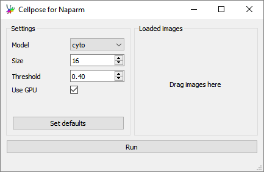
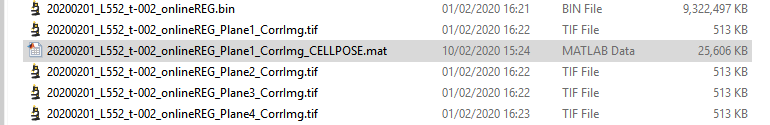
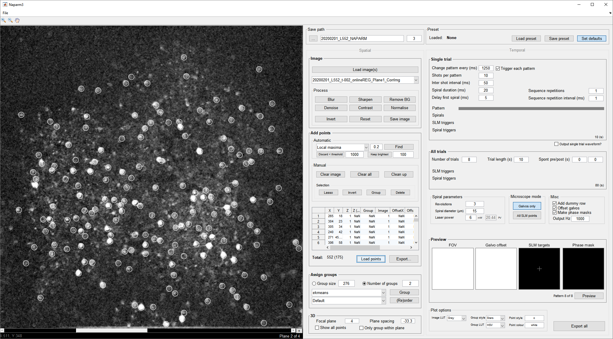
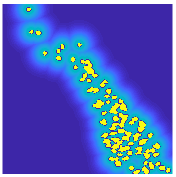

# Cellpose For Naparm
a little utility to generate [cellpose](https://github.com/MouseLand/cellpose) rois for use with [naparm](https://github.com/llerussell/Naparm)

## Usage
* drag and drop images into the window
  * multiple images corresponding to seperate z-plane can be dragged at once. multi-page tiffs can also be used.
* adjust settings (optimise using the cellpose gui)
* click run
* load the generated '*_CELLPOSE.mat' file into naparm

## Screenshots
The GUI:




The output MAT file:




Loaded into Naparm:




## Output format
_CELLPOSE.m has the following fields:
* 'software' - flag to know genreated by cellpose
* 'img' - the images loaded into cellpose
* 'files' - the filepaths of the images
* 'model' cellpose parameter - the type of model
* 'cellsize' - cellpose paramter - roi size in pixels
* 'threshold' - cellpose paramter - threhsold
* 'masks' - cellpose output - array size of images with pixel coloured accoring to roi number

## make ROIs
Load the *_CELLPOSE.m file into makeCellposeRois.m to generate ROI and halo masks to extract time-series data from movie (with extractTraces.m)
```
filepath = 'C:\Users\User\Desktop\20200119_RN191_t-001_onlineREG_Plane1_CorrImg_CELLPOSE.mat';
watershed_width = 2;
halo_multiplier = 2;
show_plot = 1;
[roi, halo] = makeCellposeRois(filepath, watershed_width, halo_multiplier, show_plot);
```


## Dependencies
* cellpose
* pyqt5
* skimage


## improvements
* figure out how to load cellpose.npy into matlab (readNPY.m does not work out the box)
* modify cellpose to save MAT files, but also need to modify to allow multiple images at once
* show output masks in this gui to allow for optimisation
* add in image manipulation (blur, bg-removal etc) to improve results
* or, run cellpose direct from matlab
  * Python Error: MXNetError: Error in operator cpnet4_downsample0_resdown0_hybridsequential5_conv0_fwd: Shape inconsistent, Provided =
[32,2,1,1], inferred shape=(32,3,1,1)
